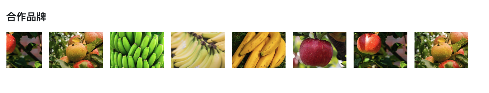

# PKGalleryMarquee - Image Marquee Carousel Component

`PKGalleryMarquee` is a lightweight image marquee carousel built with **JavaScript, jQuery, and Bootstrap 5**. It supports clickable images, pause-on-hover, custom tooltip text, and fully configurable size and speed.

---

## 🔧 Installation & Usage

### 1. Project Structure

```

project/
├── index.html
├── PKGalleryMarquee.js
├── PKGalleryMarquee.css
└── images/
├── logo1.png
├── logo2.png
└── ...

````

---

### 2. Include Resources

In your `index.html` file, include Bootstrap, jQuery, and the component’s CSS/JS:

```html
<link href="https://cdn.jsdelivr.net/npm/bootstrap@5.3.3/dist/css/bootstrap.min.css" rel="stylesheet">
<link rel="stylesheet" href="PKGalleryMarquee.css">

<script src="https://code.jquery.com/jquery-3.7.1.min.js"></script>
<script src="https://cdn.jsdelivr.net/npm/bootstrap@5.3.3/dist/js/bootstrap.bundle.min.js"></script>
<script src="PKGalleryMarquee.js"></script>
````

---

### 3. HTML Container

```html
<div id="marquee-container"></div>
```

---

### 4. JavaScript Initialization Example

```javascript
const gallery = new PKGalleryMarquee({
  containerSelector: '#marquee-container',
  width: 150,        // Image width (in px)
  height: 100,       // Image height (in px)
  speed: 20,         // Duration for one scroll loop (seconds), lower = faster
  imageItems: [
    { src: 'images/logo1.png', link: 'https://example.com/1', title: 'ULTRAHUMAN' },
    { src: 'images/logo2.png', link: 'https://example.com/2', title: 'Hyfe Health' },
    { src: 'images/logo3.png', link: 'https://example.com/3', title: 'Chamberlain Group' }
  ]
});
```

---

## ✨ Features

| Feature                | Description                                                  |
| ---------------------- | ------------------------------------------------------------ |
| Auto horizontal scroll | Uses CSS `@keyframes` animation for seamless scrolling       |
| Pause on hover         | Marquee pauses when hovered, resumes on mouse leave          |
| Clickable images       | Each image can be assigned a custom URL to open in a new tab |
| Tooltip on hover       | Shows a Bootstrap tooltip using the `title` property         |
| Responsive layout      | Uses Bootstrap 5 to adapt to container width                 |

---

## 📦 `imageItems` Format

Each item in the array should be an object with the following properties:

| Property | Type   | Description                                  |
| -------- | ------ | -------------------------------------------- |
| `src`    | string | Path to the image                            |
| `link`   | string | (Optional) URL to open when image is clicked |
| `title`  | string | (Optional) Tooltip text shown on hover       |

---

## 📜 License

MIT License — free for personal and commercial use.

```

---


## 🔗 Compatibility

* Requires jQuery 3.x or later
* Works in all modern browsers (Chrome, Edge, Firefox, Safari)


---

## 📄 Example

See `index.html` for a working demo, or contact the author for further integration help.

---

## 🖼️ Screenshot




---

## 📝 License & Author

* Author: PK
* License: MIT
 
## 💡 Support This Project

If you find this project helpful, please consider supporting the author **Powen Ko**.  
Your donation helps maintain and improve open-source software, create high-quality tutorials, and contribute to the developer community.

[](https://www.paypal.com/ncp/payment/4W7NYVPYLUHBQ)


---


# PKGalleryMarquee 跑馬燈圖片展示元件

`PKGalleryMarquee` 是一個使用 **JavaScript + jQuery + Bootstrap 5** 實作的圖片跑馬燈輪播元件。支援圖片點擊連結、滑鼠懸停暫停動畫、顯示提示文字等功能，並可客製化圖片大小與滾動速度。

---


## 🔧 安裝與使用

### 1. 檔案結構

```

project/
├── index.html
├── PKGalleryMarquee.js
├── PKGalleryMarquee.css
└── images/
├── logo1.png
├── logo2.png
└── ...

````

---

### 2. 匯入資源

於 `index.html` 引入 Bootstrap、jQuery 及此元件的 CSS / JS：

```html
<link href="https://cdn.jsdelivr.net/npm/bootstrap@5.3.3/dist/css/bootstrap.min.css" rel="stylesheet">
<link rel="stylesheet" href="PKGalleryMarquee.css">

<script src="https://code.jquery.com/jquery-3.7.1.min.js"></script>
<script src="https://cdn.jsdelivr.net/npm/bootstrap@5.3.3/dist/js/bootstrap.bundle.min.js"></script>
<script src="PKGalleryMarquee.js"></script>
````

---

### 3. HTML 結構

```html
<div id="marquee-container"></div>
```

---

### 4. JavaScript 初始化範例

```javascript
const gallery = new PKGalleryMarquee({
  containerSelector: '#marquee-container',
  width: 150,        // 單張圖片寬度(px)
  height: 100,       // 單張圖片高度(px)
  speed: 20,         // 滾動一輪所需秒數，越小越快
  imageItems: [
    { src: 'images/logo1.png', link: 'https://example.com/1', title: 'ULTRAHUMAN' },
    { src: 'images/logo2.png', link: 'https://example.com/2', title: 'Hyfe Health' },
    { src: 'images/logo3.png', link: 'https://example.com/3', title: 'Chamberlain Group' }
  ]
});
```

---

## ✨ 功能特點

| 功能     | 說明                                             |
| ------ | ---------------------------------------------- |
| 自動水平輪播 | 使用 CSS `@keyframes` 滾動實作                       |
| 滑鼠懸停暫停 | 滑鼠移至圖片上，跑馬燈暫停；移開後繼續                            |
| 圖片點擊連結 | 每張圖片可設定超連結，於新分頁開啟                              |
| 顯示提示文字 | 支援 `title` 屬性，滑鼠懸停圖片時使用 Bootstrap Tooltip 顯示說明 |
| 響應式設計  | Bootstrap 容器自適應頁面寬度                            |

---

## 📦 imageItems 格式說明

每筆資料為一個 JavaScript 物件：

| 屬性      | 型別     | 說明               |
| ------- | ------ | ---------------- |
| `src`   | string | 圖片路徑             |
| `link`  | string | 點擊圖片後的超連結（選填）    |
| `title` | string | 滑鼠懸停時顯示的提示文字（選填） |

---

## 📜 授權

MIT License - 可自由用於個人與商業用途。

 

---

## 🔗 環境支援

* 必須依賴 jQuery 3.x 或以上版本
* 適用於現代瀏覽器（Chrome, Edge, Firefox, Safari）

---

## 📝 授權與作者

* 作者：PK
* 授權：MIT License

---
##  範例 
請參考 `index.html` 或進一步聯絡作者。
 


## 螢幕截圖 


## 📬 聯絡方式

如有錯誤或功能建議，歡迎透過 GitHub Issue 或信箱聯絡作者柯博文老師 www.powenko.com。

```
## 💡 支持這個專案

如果您覺得這個專案對您有幫助，歡迎支持作者 **Powen Ko**。  
您的捐款將協助我們持續維護與改進開源工具，創作高品質的教學內容，並推動技術社群的成長。

[](https://www.paypal.com/ncp/payment/4W7NYVPYLUHBQ)
